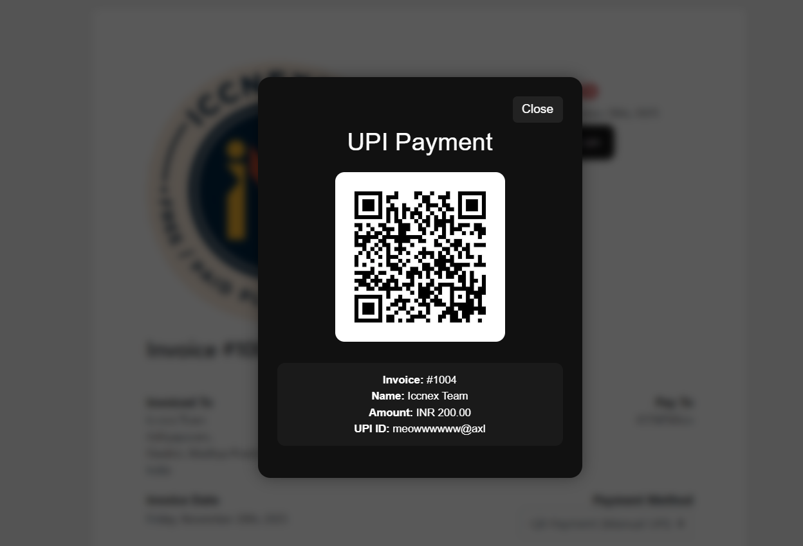

QR Payment (Manual UPI) — WHMCS Gateway Module

A lightweight, modern, popup-based Manual UPI Payment Gateway for WHMCS.
This module allows your clients to pay invoices using a QR Code or UPI ID, without requiring API integration.
Designed with a clean UI, smooth animations, and an easy configuration panel inside WHMCS.

⭐ Features

🔘 Popup-based UPI payment interface

🖼️ QR code display (dynamic via URL)

🧾 Shows invoice details & customer info

🏷️ Custom payment note/instructions

🎨 Modern UI with blur background

⚙️ Uses WHMCS standard gateway API

🚫 No UTR submission / no buttons needed

📱 Works on mobile + desktop

📁 File Structure

Place the file here:

/modules/gateways/qrpayment.php

No additional files are required.

⚙️ Installation

Download / copy the qrpayment.php file.

Upload it to your WHMCS installation:

/modules/gateways/qrpayment.php

Login to your WHMCS Admin Panel.

Go to
System Settings → Payment Gateways → All Payment Gateways

Find QR Payment (Manual UPI) and activate it.

Configure the required fields.

🛠️ Configuration Options
Setting	Description
UPI ID	Your receiving UPI ID (example: name@upi)
QR Code URL	Direct link to your payment QR image
Payment Note / Instructions	Optional message that appears under the QR
🧩 How It Works

Client opens an invoice

Selects QR Payment (Manual UPI)

Clicks the Pay Using UPI button

A popup appears containing:

QR Code

Invoice ID

Customer Name

Amount

UPI ID

Custom note

Client scans the QR and completes the payment manually.

Note: This is a manual gateway, so payments need to be marked as Paid manually inside WHMCS unless you integrate automation later.

📸 Preview (Optional)

Use markdown:

📜 Code Behavior Summary

Builds a secure WHMCS gateway

Adds a custom payment button: Pay Using UPI

Displays a modern popup with payment details

Uses HTML, CSS and inline JS for a smooth UI

No redirection — fully within the invoice page

No fetching or processing of UTR numbers (simplified)

💡 Tips

Use a high-resolution QR code for best scan results.

Avoid using free image hosts that block hotlinks.

If the popup doesn’t appear, clear WHMCS template cache.

🧩 Compatibility

WHMCS v8.x+

PHP 7.4 – 8.2

All templates (Standard Cart, Lagom, etc.)

